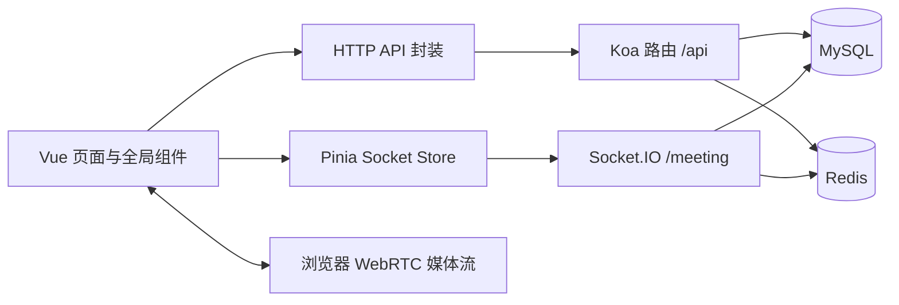

# ToDesk 功能实现链路

本文以当前 `client-vue/src` 与 `backend-koa/src` 为准，按“页面或组件 → 前端状态/API/Socket → 后端路由或事件 → MySQL/Redis/浏览器资源”的顺序说明。文中的文件名均可点击跳到源码；HTTP 地址和 Socket 事件名可直接用于排查 Network 或服务端日志。部署与启动参见 [STARTUP.md](../STARTUP.md)、[DEPLOYMENT.md](../DEPLOYMENT.md)；邮箱配置参见 [EMAIL_VERIFICATION.md](./EMAIL_VERIFICATION.md)，带宽取舍参见 [LOW_BANDWIDTH_REALTIME.md](./LOW_BANDWIDTH_REALTIME.md)。

## 1. 程序入口与公共通信层

| 层次 | 实际入口与职责 |
| --- | --- |
| 前端启动、顶层常驻组件 | [main.ts](../client-vue/src/main.ts) 装载应用；[App.vue](../client-vue/src/App.vue) 常驻挂载群通话邀请、个人通话及全局消息组件，监听登录状态建立/断开 Socket。 |
| 页面与登录守卫 | [router/index.ts](../client-vue/src/router/index.ts) 定义 `/login`、`/remote`、`/profile`、`/groups`、`/group-chat/:id`、`/group-video/:id`、`/group-screen/:id`；受保护页面会恢复当前用户或跳转登录。 |
| HTTP 请求 | [utils/request.ts](../client-vue/src/utils/request.ts) 附加 Bearer token；401 时共用一次 refresh 请求，成功重试原请求，失败清除登录状态。具体接口封装位于 [api/](../client-vue/src/api)。 |
| Socket 连接 | [stores/socket.ts](../client-vue/src/stores/socket.ts) 使用 `/meeting`，优先 WebSocket、回退 polling；连接后发 `authenticate`，重连后重入群组房间。 |
| 服务端启动 | [app.ts](../backend-koa/src/app.ts) 初始化数据库、Socket.IO 和路由；[router/index.ts](../backend-koa/src/router/index.ts) 汇总 HTTP 路由；[config/meeting.ts](../backend-koa/src/config/meeting.ts) 处理实时事件。 |
| 持久化 | [config/database.ts](../backend-koa/src/config/database.ts) 连接 MySQL 并同步模型；[models/index.ts](../backend-koa/src/models/index.ts) 定义关联；[config/redis.ts](../backend-koa/src/config/redis.ts) 连接 Redis。 |

HTTP 路由主要以 `/api/auth`、`/api/groups`、`/api/messages`、`/api/invitations`、`/api/files` 为前缀。Socket.IO 只承担实时事件和 WebRTC 信令；视频、语音、屏幕画面由浏览器的 `RTCPeerConnection` 传送，服务端不把媒体内容写入消息表。

## 2. 账号、邮箱与个人中心

### 2.1 注册与邮箱验证

1. [login.vue](../client-vue/src/views/login.vue) 的注册页填写用户名、密码和邮箱，调用 [api/auth.ts](../client-vue/src/api/auth.ts) 的 `sendEmailCode('register')`，请求 `POST /api/auth/email-code/register`。
2. [router/auth.ts](../backend-koa/src/router/auth.ts) 转到 [authEmailController.ts](../backend-koa/src/controller/authEmailController.ts)；后者先检查邮箱、IP 频率和是否已绑定，再调用 [emailVerificationService.ts](../backend-koa/src/services/emailVerificationService.ts)。该服务通过 QQ SMTP 发信，在 Redis 以哈希存放 6 位验证码，10 分钟有效；同用途同邮箱有 60 秒冷却与最多 5 次验证机会。
3. 用户提交注册表单后，`POST /api/auth/register` 进入 [authController.ts](../backend-koa/src/controller/authController.ts)。服务端核验验证码和邮箱唯一性，在同一数据库事务中创建 [User.ts](../backend-koa/src/models/User.ts) 与已验证邮箱记录 [UserEmail.ts](../backend-koa/src/models/UserEmail.ts)，随后生成 access/refresh token。
4. 前端把登录结果写入 [stores/auth.ts](../client-vue/src/stores/auth.ts)；[App.vue](../client-vue/src/App.vue) 观察 token 与用户信息，启动 Socket 连接。

`users.email` 是历史资料字段，找回密码只信任 `user_emails` 中的验证绑定；旧账号必须在个人中心重新验证并绑定邮箱。

### 2.2 登录、刷新、退出

- 账号密码登录：[login.vue](../client-vue/src/views/login.vue) → [services/loginController.ts](../client-vue/src/services/loginController.ts) → [stores/auth.ts](../client-vue/src/stores/auth.ts) → `POST /api/auth/login` → [authController.ts](../backend-koa/src/controller/authController.ts)。账号可以是用户名或 [UserEmail.ts](../backend-koa/src/models/UserEmail.ts) 中的已验证邮箱；服务端用 [User.ts](../backend-koa/src/models/User.ts) 核验密码。
- 邮箱验证码登录：同一登录页调用 [api/auth.ts](../client-vue/src/api/auth.ts) 的 `sendEmailCode('login')`，经 `POST /api/auth/email-code/login` → [authEmailController.ts](../backend-koa/src/controller/authEmailController.ts) → [emailVerificationService.ts](../backend-koa/src/services/emailVerificationService.ts) 向已绑定邮箱发码。提交验证码时调用 `POST /api/auth/login/email-code`，由 [authController.ts](../backend-koa/src/controller/authController.ts) 消费登录专用验证码。未注册邮箱会直接提示错误，不会发送验证码。
- 两种登录方式共用服务端的登录收尾流程：更新在线状态，签发 [utils/jwt.ts](../backend-koa/src/utils/jwt.ts) 的 token 对，通过 [redisService.ts](../backend-koa/src/services/redisService.ts) 保存 refresh token；前端统一保存登录状态并处理登录前页面跳转。
- 页面刷新时，[router/index.ts](../client-vue/src/router/index.ts) 用 `GET /api/auth/me` 恢复用户；[utils/request.ts](../client-vue/src/utils/request.ts) 遇 401 调 `POST /api/auth/refresh-token` 并重试一次。服务端 [middleware/auth.ts](../backend-koa/src/middleware/auth.ts) 验证 token 和 [tokenVersionService.ts](../backend-koa/src/services/tokenVersionService.ts) 中的版本。
- 退出由 [stores/auth.ts](../client-vue/src/stores/auth.ts) 调 `POST /api/auth/logout`，清理本地认证；[App.vue](../client-vue/src/App.vue) 断开 Socket。后端清除 refresh token 并更新用户状态。

### 2.3 绑定、找回和修改密码

| 操作 | 前端 → 后端 → 数据/结果 |
| --- | --- |
| 旧账号绑定邮箱 | [profile.vue](../client-vue/src/views/profile.vue) → [api/auth.ts](../client-vue/src/api/auth.ts) `email-code/bind`、`bind-email` → [authEmailController.ts](../backend-koa/src/controller/authEmailController.ts) 消费验证码，在事务中写 [UserEmail.ts](../backend-koa/src/models/UserEmail.ts) 并更新用户资料。 |
| 忘记密码 | [login.vue](../client-vue/src/views/login.vue) → `email-code/reset`、`reset-password` → [authEmailController.ts](../backend-koa/src/controller/authEmailController.ts) 查已验证绑定，核验验证码、更新密码并撤销旧 token。发码接口会直接提示未注册邮箱错误。 |
| 登录后改密 | [profile.vue](../client-vue/src/views/profile.vue) → `email-code/change-password`、`change-password` → [authController.ts](../backend-koa/src/controller/authController.ts) 同时核验旧密码和绑定邮箱验证码，成功后要求重新登录。 |
| 资料修改 | [profile.vue](../client-vue/src/views/profile.vue) → `GET/PUT /api/auth/me` → [authController.ts](../backend-koa/src/controller/authController.ts) 更新昵称、头像、简介、电话、状态等，并刷新 Redis 用户缓存；普通资料接口不允许直接修改邮箱。 |

## 3. 联系人和在线状态

1. 登录后的 [App.vue](../client-vue/src/App.vue) 通过 [stores/socket.ts](../client-vue/src/stores/socket.ts) 发 `authenticate`。服务端 [config/meeting.ts](../backend-koa/src/config/meeting.ts) 校验 access token，从 [User.ts](../backend-koa/src/models/User.ts) 读取状态，并把该 Socket 加入内存中的在线映射。
2. 服务器只向新连接发送一次 `user_list` 全量在线快照；之后在登录、状态更新或断开时广播单个 `user_presence` 增量。客户端 [stores/socket.ts](../client-vue/src/stores/socket.ts) 合并增量，并在断线时清空在线名单。
3. [remoteShare/index.vue](../client-vue/src/views/remoteShare/index.vue) 用 [api/auth.ts](../client-vue/src/api/auth.ts) 的 `GET /api/auth/users` 获取用户基础列表，再通过 [contactPresence.ts](../client-vue/src/services/contactPresence.ts) 合并私信发送人和在线名单。离线用户仍出现在联系人列表，只是状态为离线；因此“联系人”目前不是固定好友关系。
4. 个人状态变化走 `status_update`；[config/meeting.ts](../backend-koa/src/config/meeting.ts) 更新用户状态，并向客户端发在线增量。群成员页面也复用这份在线名单。

在线映射在当前 Socket.IO 实例内；多后端实例需要共享事件与房间状态，参见 [LOW_BANDWIDTH_REALTIME.md](./LOW_BANDWIDTH_REALTIME.md)。

## 4. 群组管理和成员邀请

- [groups.vue](../client-vue/src/views/groups.vue) 调用 [api/group.ts](../client-vue/src/api/group.ts)，经 [router/group.ts](../backend-koa/src/router/group.ts) 到 [groupController.ts](../backend-koa/src/controller/groupController.ts)。创建、列表、详情、编辑、退出、删除分别使用 `POST /api/groups`、`GET /api/groups/my`、`GET /api/groups/:id`、`PUT /api/groups/:id`、`DELETE /api/groups/:id/leave`、`DELETE /api/groups/:id`。数据是 [Group.ts](../backend-koa/src/models/Group.ts)、[GroupMember.ts](../backend-koa/src/models/GroupMember.ts)；删除还调用 [groupDeletionService.ts](../backend-koa/src/services/groupDeletionService.ts) 清理群关联记录。
- 管理员从 [groups.vue](../client-vue/src/views/groups.vue) 选择被邀请人，`POST /api/groups/:id/invite` 在 [groupController.ts](../backend-koa/src/controller/groupController.ts) 创建 [GroupInvitation.ts](../backend-koa/src/models/GroupInvitation.ts)。被邀请人从 [remoteShare/index.vue](../client-vue/src/views/remoteShare/index.vue) 调 [api/invitation.ts](../client-vue/src/api/invitation.ts) 的 `GET /api/invitations` 查待处理邀请；接受/拒绝由 [invitationController.ts](../backend-koa/src/controller/invitationController.ts) 更新邀请状态，接受时创建群成员关系。
- 管理员在群详情中切换成员能否发言，路径为 [groups.vue](../client-vue/src/views/groups.vue) → `POST /api/groups/:id/permission` → [groupController.ts](../backend-koa/src/controller/groupController.ts) → `GroupMember.canSpeak`。群消息发送时 [config/meeting.ts](../backend-koa/src/config/meeting.ts) 再检查该字段。

这里的“加入群组邀请”是成员资格流程；第 7 节的“群视频/共享邀请”是已经存在的群会话呼叫流程，二者不是同一事件。

## 5. 私聊、群聊和未读消息

### 5.1 私信发送与历史

1. [remoteShare/index.vue](../client-vue/src/views/remoteShare/index.vue) 的 [TextMsg.vue](../client-vue/src/components/TextMsg.vue) 触发发送，页面生成 `clientMessageId`，显示“发送中”，由 [reliableMessage.ts](../client-vue/src/services/reliableMessage.ts) 通过 Socket `private_message` 发送，超时使用同一 ID 重试。
2. [config/meeting.ts](../backend-koa/src/config/meeting.ts) 调 [reliableMessageService.ts](../backend-koa/src/services/reliableMessageService.ts)，在 MySQL 写 [Message.ts](../backend-koa/src/models/Message.ts)。[MessageReceipt.ts](../backend-koa/src/models/MessageReceipt.ts) 用“发送用户 + 消息类型 + 客户端 ID”唯一键去重；同 ID 同内容重试返回原消息 ID，不再次推送。只有写库成功 ACK 后前端标记“已发送”，失败可点击重试。
3. 服务端向接收方在线 Socket 发 `private_message`；[GlobalMessages.vue](../client-vue/src/components/GlobalMessages.vue) 增加未读计数、播放提醒或显示横幅。[remoteShare/index.vue](../client-vue/src/views/remoteShare/index.vue) 同时维护当前打开的会话列表。
4. 打开会话时，[api/message.ts](../client-vue/src/api/message.ts) 调 `GET /api/messages/private?contactUserId=...`，由 [messageController.ts](../backend-koa/src/controller/messageController.ts) 查双方近 30 天的消息。已看到的对方消息通过 `POST /api/messages/mark-read` 更新 `Message.isRead`。

### 5.2 群消息和断线补偿

1. [groupChat.vue](../client-vue/src/views/groupChat.vue) 生成客户端消息 ID，通过 [reliableMessage.ts](../client-vue/src/services/reliableMessage.ts) 发 `group_message`；后端 [config/meeting.ts](../backend-koa/src/config/meeting.ts) 检查群成员及发言权限，调用 [reliableMessageService.ts](../backend-koa/src/services/reliableMessageService.ts) 写 [GroupMessage.ts](../backend-koa/src/models/GroupMessage.ts)，ACK 后向 `group_<id>` 房间推送。
2. 页面进入群聊时，用 [api/message.ts](../client-vue/src/api/message.ts) 的 `GET /api/messages/group/:groupId` 读取历史；后端 [messageController.ts](../backend-koa/src/controller/messageController.ts) 校验成员身份，每页最多 100 条。
3. 全局 [GlobalMessages.vue](../client-vue/src/components/GlobalMessages.vue) 在 Socket 认证后获取自己的群组、重新订阅群房间；[groupMessageCursor.ts](../client-vue/src/services/groupMessageCursor.ts) 按账号保存每群已处理消息 ID。重连时调用 `GET /api/messages/group/:groupId?afterId=...` 分页补齐，按消息 ID 去重。首次没有游标时，`GET /api/messages/group-cursors` 取各群最新 ID 作为起点，既有历史仍可在群聊页面查看。
4. `join_group`、`leave_group` 与 `group_members`/`group_member_joined`/`group_member_left` 只管理在线房间和成员显示；真正的群成员资格在 MySQL 的 [GroupMember.ts](../backend-koa/src/models/GroupMember.ts)。

### 5.3 全局提醒与徽标的来源

[stores/unread.ts](../client-vue/src/stores/unread.ts) 分别保存私信发送人和群组的未读数，并用消息 ID 防止同一页面重复计数；[GlobalMessages.vue](../client-vue/src/components/GlobalMessages.vue) 在所有业务页可见，除 `/remote` 外显示全局未读入口。联系人和群组行徽标由 [remoteShare/index.vue](../client-vue/src/views/remoteShare/index.vue) 渲染。进入私聊或群聊时相应计数清零。私信是否已读还持久化在 MySQL；群未读数主要是客户端会话状态，断线补齐依赖浏览器本地游标。

## 6. 个人视频与个人屏幕共享

1. [remoteShare/components/ToolBar.vue](../client-vue/src/views/remoteShare/components/ToolBar.vue) 选择当前联系人后把发起视频/共享动作交给顶层 [GlobalPrivateCall.vue](../client-vue/src/components/GlobalPrivateCall.vue)；[stores/privateCall.ts](../client-vue/src/stores/privateCall.ts) 保留跨页面的发起目标。发起方先通过浏览器获取摄像头或屏幕流，再发送 `webrtc_call_request`，因此共享邀请从发起时开始，而不是等进入页面后再点击开始。
2. 服务端 [config/meeting.ts](../backend-koa/src/config/meeting.ts) 把请求转给目标 Socket。顶层 [GlobalPrivateCall.vue](../client-vue/src/components/GlobalPrivateCall.vue) 无论当前在什么页面都可显示接听/拒绝界面；[notificationService.ts](../client-vue/src/services/notificationService.ts) 播放循环来电音。接听/拒绝回复 `webrtc_call_response`。
3. 双方用 `webrtc_offer`、`webrtc_answer`、`webrtc_ice` 交换 SDP 与 ICE；浏览器 `RTCPeerConnection` 传输音视频，`webrtc_hangup` 结束通话。[remoteShare/components/config.ts](../client-vue/src/views/remoteShare/components/config.ts) 定义采集约束，[mediaBitrate.ts](../client-vue/src/services/mediaBitrate.ts) 尝试限制视频发送码率。
4. 视频通话界面默认全屏，可切换可拖动的小窗、切换主副画面、静音或停用摄像头；这些交互均在 [GlobalPrivateCall.vue](../client-vue/src/components/GlobalPrivateCall.vue)，不需要后端保存画面布局。

## 7. 群视频与群屏幕共享

1. [groups.vue](../client-vue/src/views/groups.vue) 与 [groupChat.vue](../client-vue/src/views/groupChat.vue) 可进入 [groupVideo.vue](../client-vue/src/views/groupVideo.vue) 或 [groupScreen.vue](../client-vue/src/views/groupScreen.vue)。群共享先在用户点击按钮的手势中通过 [screenShareLaunch.ts](../client-vue/src/services/screenShareLaunch.ts) 取得 `getDisplayMedia` 流，发送 `group_call_start` 后跨路由交给共享页；视频页在认证完成后发 `group_call_start`。
2. [config/meeting.ts](../backend-koa/src/config/meeting.ts) 调 [groupSessionService.ts](../backend-koa/src/services/groupSessionService.ts)；[redisGroupSessionStore.ts](../backend-koa/src/services/redisGroupSessionStore.ts) 用 Redis NX 防止同群同类型会话重复创建，保存会话拥有者、通道 ID 和开始时间。视频与共享是两个独立类型。服务端依据 [GroupMember.ts](../backend-koa/src/models/GroupMember.ts) 向所有群成员的在线 Socket 发 `group_call_started`，不要求成员已经打开群聊天页。
3. 顶层 [GroupCallInvitations.vue](../client-vue/src/components/GroupCallInvitations.vue) 按群 ID、类型和开始时间去重，显示全局接听/拒绝弹窗并播放来电音；接受时进入对应群媒体页。媒体页用 `join_group_call` 加入当前媒体通道，服务器回 `group_call_members` 和 `group_call_presence`；[mediaRoomRegistry.ts](../backend-koa/src/services/mediaRoomRegistry.ts)、[mediaParticipantState.ts](../client-vue/src/services/mediaParticipantState.ts) 跟踪谁真正进入会议。
4. 参会者通过 `group_webrtc_offer`、`group_webrtc_answer`、`group_webrtc_ice` 建立彼此的媒体连接。[remotePeerRegistry.ts](../client-vue/src/services/remotePeerRegistry.ts) 管理远端连接；[mediaBitrate.ts](../client-vue/src/services/mediaBitrate.ts) 对视频发送端设上限。离开/结束走 `leave_group_call`/`group_call_end`，服务端广播 `group_call_member_left`、`group_call_presence` 或 `group_call_ended`，共享结束时同时清理标注。
5. 群视频的静音、关摄像头和虚拟背景入口在 [groupVideo.vue](../client-vue/src/views/groupVideo.vue)；[VirtualBackground.vue](../client-vue/src/components/VirtualBackground.vue) 与 [backgroundProcessor.ts](../client-vue/src/services/backgroundProcessor.ts) 在浏览器处理原始摄像头流并替换发送轨道。群共享质量档位和共享媒体流在 [groupScreen.vue](../client-vue/src/views/groupScreen.vue)。[SpeakingIndicator.vue](../client-vue/src/components/SpeakingIndicator.vue) 与 [speakingDetector.ts](../client-vue/src/services/speakingDetector.ts) 从音频流驱动发言标记，后端不另发“正在说话”事件。

## 8. 共享标注、录制与文件

### 8.1 共享标注

- [groupScreen.vue](../client-vue/src/views/groupScreen.vue) 在视频实际显示区域叠加 [ScreenAnnotation.vue](../client-vue/src/components/ScreenAnnotation.vue)。工具栏默认靠底部，可在视口内拖动；画笔、线、箭头、矩形、圆、文字、橡皮、颜色和粗细由组件管理。[annotationGeometry.ts](../client-vue/src/services/annotationGeometry.ts) 计算视频在容器中的真实位置；画布坐标归一化，适配不同屏幕尺寸。
- 屏幕共享者绘制时，组件发 `draft`/`complete`；[groupScreen.vue](../client-vue/src/views/groupScreen.vue) 映射为 `screen_annotation_draft`/`screen_annotation_complete` Socket 事件。服务端 [config/meeting.ts](../backend-koa/src/config/meeting.ts) 核对会话开始时间，[screenAnnotationService.ts](../backend-koa/src/services/screenAnnotationService.ts) 验证格式、数量和共享者权限。草稿直接广播，完成的笔画存入 [redisScreenAnnotationStore.ts](../backend-koa/src/services/redisScreenAnnotationStore.ts) 并广播；后来加入的人收到 `screen_annotation_snapshot`。
- 撤销/清空走 `screen_annotation_undo`/`screen_annotation_clear`。前端 [screenAnnotationState.ts](../client-vue/src/services/screenAnnotationState.ts) 按 `actionId` 合并草稿、完成笔画和快照。当前只有屏幕共享者能发起标注，其他参会者只读观看；共享结束会删除 Redis 中本次会话的标注。

### 8.2 录制与文件上传

[MediaRecorder.vue](../client-vue/src/components/MediaRecorder.vue) 使用浏览器 MediaRecorder 录制传入的流，群视频和群共享分别在 [groupVideo.vue](../client-vue/src/views/groupVideo.vue)、[groupScreen.vue](../client-vue/src/views/groupScreen.vue) 使用；其录制开始、停止与下载/预览在浏览器侧完成。当前 `handleRecordingStop` 主要提示录制结果，并未自动上传会议录像。头像等普通文件上传由 [api/common.ts](../client-vue/src/api/common.ts) 发 `POST /api/files/upload`；后端 [router/file.ts](../backend-koa/src/router/file.ts) → [fileController.ts](../backend-koa/src/controller/fileController.ts) 写入上传目录与 [File.ts](../backend-koa/src/models/File.ts)。`GET /api/files`、`GET /api/files/:fileId/download`、`DELETE /api/files/:fileId` 也在后端实现，但主界面目前主要调用上传接口。

## 9. 桌面通知、声音与移动端

- [profile.vue](../client-vue/src/views/profile.vue) 的桌面通知、声音、预览和通知类型开关写到 [notificationService.ts](../client-vue/src/services/notificationService.ts)，后者从浏览器 `localStorage` 恢复设置并调用浏览器 Notification 权限 API；这些不是 MySQL 用户字段。测试通知也由该服务发出。
- 消息事件由 [GlobalMessages.vue](../client-vue/src/components/GlobalMessages.vue) 决定横幅、桌面通知和短提示音；个人/群呼叫分别由 [GlobalPrivateCall.vue](../client-vue/src/components/GlobalPrivateCall.vue)、[GroupCallInvitations.vue](../client-vue/src/components/GroupCallInvitations.vue) 启停循环来电音。来电音在 [notificationService.ts](../client-vue/src/services/notificationService.ts) 本地生成，无额外音频下载。
- 移动端入口和布局主要由 [App.vue](../client-vue/src/App.vue)、[remoteShare/index.vue](../client-vue/src/views/remoteShare/index.vue)、[groups.vue](../client-vue/src/views/groups.vue)、[groupChat.vue](../client-vue/src/views/groupChat.vue)、[groupVideo.vue](../client-vue/src/views/groupVideo.vue)、[groupScreen.vue](../client-vue/src/views/groupScreen.vue) 的媒体查询与侧栏展开状态处理。共享标注的指针事件及工具栏边界处理在 [ScreenAnnotation.vue](../client-vue/src/components/ScreenAnnotation.vue)。媒体权限与浏览器自动播放限制仍由终端浏览器决定。

## 10. 低带宽路径、监控与当前边界

静态资源由 [vite.config.ts](../client-vue/vite.config.ts) 构建压缩；HTTP 和 Socket 在生产环境分别通过 [docker-compose.prod.yml](../docker-compose.prod.yml) 与 [Caddyfile](../Caddyfile) 暴露。后端 [config/meeting.ts](../backend-koa/src/config/meeting.ts) 每分钟写 `realtime_metrics` 日志，包含连接数、WebSocket/polling 数量及消息写入耗时 p95；不含消息正文。实际出站带宽及 TURN 中继流量还须从服务器监控与浏览器 WebRTC 统计观察。

当前需特别注意的实现边界：

1. 群未读游标存浏览器本地，同一账号更换浏览器时不会自动继承旧浏览器的群未读状态；群消息本身仍在 MySQL，可打开群历史查看。
2. 没有固定的好友关系模型，在线状态仍按所有在线用户广播增量，联系人列表则合并基础用户和实时状态。不能直接把广播缩到“好友”，否则部分联系人会漏更新。
3. 当前部署为单个 Socket.IO 实例；扩容到多个后端时，内存在线映射、Socket 房间及跨实例事件需要共享适配器。
4. [router/index.ts](../client-vue/src/router/index.ts) 中 `/chat`、`/socket`、`/share` 标为测试功能路由。`/chat` 对应 [views/chat.vue](../client-vue/src/views/chat.vue) → `POST /api/chat/send` → [router/chat.ts](../backend-koa/src/router/chat.ts)，返回模拟 AI 的 SSE 字符流；[router/sse.ts](../backend-koa/src/router/sse.ts) 另外提供 `GET /api/sse/connect` 演示流。`/socket` 的 [views/socket.vue](../client-vue/src/views/socket.vue) 使用 [hooks/useSocket.ts](../client-vue/src/hooks/useSocket.ts) 做独立 Socket/WebRTC 演示；`/share` 的 [views/share.vue](../client-vue/src/views/share.vue) 在浏览器本地共享、截图、录制。它们不参与上述主业务消息、邀请和通话链路；[config/initializeSocket.ts](../backend-koa/src/config/initializeSocket.ts) 未被当前 [app.ts](../backend-koa/src/app.ts) 调用。
5. 当前 `join_group` 和 `join_group_call` Socket 处理器主要管理房间及会话状态，未在这些入口再次查询群成员资格；发送群消息和读取群历史分别有成员校验。若以后向非成员开放群 ID 或部署多租户，需要补上房间加入权限校验。
