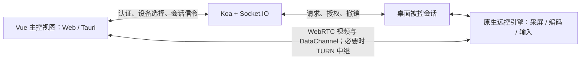

# 远程控制功能规划

日期：2026-09-25，修订版 v2。状态：正在分阶段实施；认证、设备注册与协议门禁已有基础实现，完整远控引擎和实际键鼠控制尚未交付。当前完成范围以[实施进度](./2026-09-25-remote-control-implementation.md)和[M0 实测记录](./2026-09-25-remote-control-m0-validation.md)为准。下文接口、参数和文件属于目标设计，不能全部视为已上线能力。时间、码率和容量数值是首轮实现/测试基线，调整必须同步协议与验收用例。

2026-09-26 补充：[签名凭据与主控接入合同](./2026-09-26-remote-control-wire-protocol.md)固定了 Node/Rust/浏览器共用的签名格式、设备同意证明、实际 DTLS 绑定、租约连续性和重新授权事件；本文件中的概念流程应与该合同配合实施。

## 0. 本次评审发现与修订

| 级别 | 原方案不足及后果 | 本版决策 |
| --- | --- | --- |
| 阻断 | “联系人在线”与“设备可控”混用；项目联系人并非好友关系 | 新增设备身份、临时协助授权和设备发现范围，不沿用全站用户列表作为远控权限 |
| 阻断 | 仅依靠前端接受、短时凭据和 Socket 断开，无法及时停止仍存活的 P2P 输入 | 原生持有本地同意记录，输入代次隔离，服务端短租约与原生看门狗共同约束 |
| 阻断 | 缺少设备凭据、注销/改密撤销和并发抢占规则 | 密钥绑定设备，明确认证撤销、原子状态转换与同一端点单会话限制 |
| 阻断 | 引擎尚未选型，却默认 Windows/macOS 可以共享同一实现路径 | 固定架构边界，设置编解码、采屏、输入、发布包四项技术验证门槛；未通过的平台不开启 |
| 高 | 可丢弃指针与可靠按键之间没有跨通道顺序，可能在旧坐标点击或断网后卡键 | 首版统一可靠有序输入通道，补充坐标、代次、布局版本、流控及按键释放规则 |
| 高 | 把主控能力和本机被控权限耦合；原生权限不足可能错误地阻止主控 | 主控不要求本机采屏或输入注入权限，图标展示/可发起/可被控分别计算 |
| 高 | 隐藏到托盘后缺少独立停止入口，进程崩溃清理未定义 | 常驻原生状态/停止入口、锁屏/休眠/退出/崩溃处理表 |
| 高 | TURN 配置、凭据、容量和灰度回滚没有交付要求 | 会话级短时凭据、强制中继验收、服务端开关、续租拒绝与回滚门槛 |
| 中 | P1 与 P2 的设备管理、多屏、中文输入边界模糊，验收缺少指标 | 拆分最小设备注册与高级管理、连接前选屏与会话内切屏，列出可重复验证矩阵 |
| 中 | “录屏须授权”容易被误解成可阻止主控本地录制；日志保留未定义 | 区分产品内授权与接收画面的客观风险，限定审计内容和保留期限 |

## 1. 结论与范围

Web 可以作为主控端：浏览器显示远端画面，采集当前远控视图内的键鼠操作，通过 WebRTC DataChannel 发送到被控电脑的原生客户端执行。纯 Web 页面不能充当通用的系统级被控端；屏幕共享权限不包含操作系统键鼠控制权限。

因此不要永久把“发起远控”限定为桌面端。建议先完成 Windows/macOS 桌面被控能力和桌面主控闭环，再开放通过兼容性验收的 Web 主控。未开放 Web 主控期间按实际 Tauri 运行环境隐藏 Web 入口，满足阶段性“仅桌面显示”的要求。

首版场景：双方已登录，被控方为指定账号开启临时协助，主控选择获准发现的在线设备，被控方再次明确同意本次观看/控制后开始。每个原生设备最多参与一场远控（主控或被控二选一），每个 Web 主控实例最多一场，不允许自控或远控链式转发。暂不包含无人值守、登录屏幕、提权桌面、手机被控和开机后台服务。

默认以 Windows 11 x64、macOS 13+（Apple Silicon 与 Intel 分别验证）为远控候选平台；这是新增功能的验证基线，不修改现有客户端的最低系统版本承诺。桌面主控使用同一 Vue/WebRTC 视图，原生引擎只对被控角色必需。Web 首批候选为桌面 Chrome/Edge 发布时最新稳定版及前一主版本；Safari、Firefox、移动浏览器验证后单独开放。不支持的版本继续使用既有聊天/共享功能。

## 2. 设计评审时的仓库基线

| 已有代码 | 能复用的部分 | 尚缺的部分 |
| --- | --- | --- |
| `client-vue/src/views/remoteShare/components/ToolBar.vue` | 聊天工具栏，已有共享、视频、语音入口 | 独立远控按钮、按目标设备判断能力 |
| `client-vue/src/components/GlobalPrivateCall.vue` | WebRTC 协商、媒体展示、呼叫交互可作参考 | 远控会话和输入通道；不能直接把通话接受等同于远控授权 |
| `client-vue/src/stores/socket.ts`、`backend-koa/src/config/meeting.ts` | 登录认证、Socket 信令、在线状态基础 | 按设备注册、会话授权、能力协商与撤销 |
| `client-vue/src-tauri/src/main.rs`、`Cargo.toml` | Windows/macOS 桌面壳、托盘、文件与通知能力 | 原生采屏、编码传输、输入注入、系统权限检测 |
| `client-vue/src/services/saveFile.ts` 等 | 已使用 `isTauri()` 判断运行环境 | 统一的远控能力探测 |

现有用户在线不代表其某台设备可被控制，Tauri 壳存在也不代表远控引擎就绪。

需要改造的接入点：

- `meeting.ts` 的 `getPublicUsers()` 按 userId 去重，`stores/socket.ts` 同样按用户合并，且过滤本账号；远控设备不能存入该列表。
- `authController.ts` 的 `getUserList()` 获取所有用户，不能据此允许发现对方设备。现有 `webrtc_offer/answer/ice` 按客户端提供的 socketId 转发，远控必须使用独立的、已鉴权会话路由。
- 现有 `logout()` 未调用 `invalidateUserTokens()`；仅清理状态/刷新凭据不能保证旧访问令牌和存活 Socket 立即失效。远控上线前需完成第 6.2 节的撤销整合。
- `GlobalPrivateCall.vue` 内包含固定 ICE 地址与凭据配置；远控不得复制其中的静态凭据。本仓库的基础设施 compose 不含 TURN 部署，需补部署文档与健康检查。
- `main.rs` 在关窗时隐藏主窗口并保留进程；远控必须增加独立原生停止入口。`tauri.macos.conf.json` 当前最低版本为 12.0、签名为 ad-hoc，不能直接当作正式远控安装包验收结果。

## 3. 支持矩阵与图标规则

| 当前端 | 作为主控端 | 作为被控端 | 入口策略 |
| --- | --- | --- | --- |
| 通过验收的 Windows/macOS Tauri | WebView 播放/输入协议通过即可，无需本机被控权限 | 原生模块就绪、支持当前系统且用户授权后支持 | 分别展示“远程控制”和“允许对方协助”入口 |
| 桌面浏览器 | Web 主控发布、HTTPS 和 WebRTC 能力通过后支持 | 不支持系统级被控 | Web 主控发布前隐藏；发布后显示“远程控制”，隐藏“允许控制本机” |
| 移动浏览器 | 后续验证触控、键盘、后台行为 | 不支持系统级被控 | 首版隐藏 |
| 不支持的系统/旧客户端 | 按能力报告判断 | 不支持或要求升级 | 不提供可发起操作，展示原因或升级引导 |

运行环境用 `@tauri-apps/api/core` 的 `isTauri()`，不能用浏览器 UA 含 Windows/Mac、窗口宽度或 `VITE_DESKTOP` 构建标记代替。浏览器打开桌面构建产物仍不是原生客户端。

拟新增 `remoteControlCapabilities.ts`，统一输出以下信息，图标、路由、连接按钮共用同一判断：

- `runtime`: web / tauri；桌面系统、架构、`engineReady`、`protocolVersion` 来自原生模块握手。
- 主控报告 `canDecodeVideo`、`canUseDataChannel`、`canSendInput`；被控报告 `canCapture`、`canInjectInput`，并分别派生 `canControl`、`canHostView`、`canHostControl`。
- `permissions`: 屏幕采集、输入控制的 granted / denied / unknown / unsupported 状态；获得应用焦点、系统设置返回、引擎重启、系统会话变化时重新探测；会话中原生侧持续检查，不能只在页面加载时读取。
- `reason`: 功能未发布、环境不支持、引擎未就绪、权限未授予、版本不兼容等。
- 目标设备上报 `deviceId`、在线状态、平台及能力，由服务端绑定已认证设备；前端自报能力只能用于展示，不能当作授权。

展示与可点击分开：

1. 桌面阶段：主控入口条件为 `desktopControllerEnabled && isTauri() && releasedPlatform`；主控解码/协议不支持时提供升级说明；本机未授予采屏/辅助功能权限不影响发起控制。被控入口单独受 `desktopHostEnabled`、原生引擎及系统能力限制。
2. Web 发布后：浏览器需 `webControllerReleaseEnabled && controllerSupported` 才显示入口；不依赖 `getDisplayMedia`，因为主控观看远端无需采集本机屏幕。
3. 发起按钮还要求已选且有权发现的目标设备、设备在线、本端可主控、双方无冲突会话。只具备采屏能力时允许“请求观看”；能注入键鼠时才提供“请求控制”。对方仅网页登录时提示“对方需要在桌面客户端开启远程协助”。
4. 页面直达也检查能力；服务端和原生引擎独立鉴权。隐藏按钮不是安全边界。
5. 当前未实现远控引擎，正式功能入口保持关闭；不要新增可以点击但无法远控的占位按钮。

开关由已认证配置接口下发，构建变量仅作为本地上限。请求失败、旧客户端缺字段、能力未知均默认不可发起；服务端每次建会话/续租再检查开关。Web 允许列表只决定发布范围，不能通过 UA 声称已具备能力。

## 4. 功能分期

以下为本项目取舍，不代表复刻 ToDesk 的全部规格或版本权益。

| 阶段 | 功能 | 交付边界 |
| --- | --- | --- |
| P0 技术验证 | Windows/macOS 采屏、权限检测、输入注入、原生媒体接入、跨网络连接 | 每个平台先验证画面与键鼠闭环，决定原生引擎方案 |
| P1 有人值守远控 | 最小设备注册/解绑、临时协助授权、设备选择、请求/接受/拒绝/取消/超时 | 账号登录，单会话单操作者；观看与控制分开授权 |
| P1 基础操作 | 鼠标移动、单击/双击、右键、拖拽、滚轮、常用键盘输入和组合键 | 首版不承诺系统保留快捷键或提权窗口操作 |
| P1 画面工具 | 连接前选定一块屏幕、适应窗口/原始比例、全屏、清晰/均衡/流畅档位、网络状态 | 最高目标 1080p/30fps；会话内切屏放 P2，布局变化先停止输入 |
| P1 会话管理 | 被控提示条、暂停控制、恢复需确认、一键结束、本地紧急停止、连接记录 | 检测到断线即停止，黑洞网络受看门狗/租约时限约束；重连重新授权 |
| P1b Web 主控 | 桌面浏览器看画面和发送输入 | 桌面 P1a 闭环后发布；技术验证阶段就要验证浏览器互通 |
| P2 办公增强 | 文本剪贴板、文件传输、显示器切换、系统声音、语音沟通、截图/录屏、白板批注 | 剪贴板/文件/录屏分别授权；文件独立流控，复用现有沟通能力 |
| P2 设备管理 | 设备分组、最近连接、设备码与短时连接码、可信设备、连接统计 | 不推迟 P1 必需的注册/撤销/别名；可信设备也不默认免除控制授权 |
| P3 高级运维 | 无人值守、开机服务、锁屏/重启重连、二次验证、团队策略与审计 | 需独立原生服务和更完整的身份认证 |
| P3 平台专项 | 隐私屏、虚拟屏、多会话/多人协作、远程终端、外设映射、远程唤醒 | 分平台评估驱动、权限与网络条件；不列入首版承诺 |

ToDesk 的高帧率、超高清和极低延迟宣传不作为本项目验收指标。先保障普通办公可用和撤销控制可靠。

## 5. 交互设计

- 联系人工具栏在“屏幕共享”旁新增“远程控制”图标及文字，二者有独立流程。
- 被控方先在“允许对方协助”中指定账号，开启最长 15 分钟的设备发现许可；默认关闭，不自动在重启后恢复。主控点击后只显示该账号临时授权可见的桌面设备，不向同账号所有设备广播。
- 被控端显示发起人、目标设备、所请求权限，提供“仅允许观看”“允许控制”“拒绝”。权限尚未齐备时先引导设置，再重新确认。
- 会话窗口上方展示设备、连接状态、画质、缩放、权限与结束；画面获得焦点后才发送键鼠事件，输入坐标限定在有效画面区域。
- 被控端持续显示操作者、共享屏幕和“停止共享 / 暂停控制”；最小化主窗口仍保留原生状态窗、托盘结束项和本地紧急停止快捷键。禁止在被控期间通过远端输入点击接受/恢复授权，或关闭/禁用停止入口。
- 结束后清理媒体轨道、DataChannel、输入监听和原生注入状态；记录时间、双方设备、结果及结束原因。

首版远控与本端任一私聊/群组音视频或屏幕共享互斥，聊天文字仍可使用。新增统一媒体占用协调器，不能仅依赖 `privateCall.busy`；后续 P2 才增加远控内语音。路由变化不自动销毁会话；主控视图隐藏/失焦立即停止输入，被控普通窗口失焦不影响已授权协助，否则无法操作其他应用。账号退出/切换必须先停止原生会话，再等待登出 API。

“只观看”仍会暴露选定屏幕内容。应用内录屏需要单独授权，但无法阻止接收方使用操作系统或外部设备录制；产品文案不能承诺禁止对方截图或录像。

## 6. 技术架构

采用独立 `remote-control` 协议域，与现有视频通话状态分离。可复用 ICE 配置、认证和界面组件，但不能把既有通话类型 0/1/2 的屏幕共享直接升级为控制。

### 6.1 原生引擎与信任边界

架构决策：Tauri Rust 宿主作为会话监督器，管理设备密钥、本地同意记录、停止入口和引擎子进程；原生引擎拥有被控端的 WebRTC PeerConnection、采集/编码与受限输入执行。Vue 负责主控展示和操作意图，不能直接调用任意系统输入或给自己授予控制权。媒体由原生直接进入 WebRTC，不经 Tauri IPC 逐帧传图。

P0 优先验证 libwebrtc 原生封装；可对比 [GStreamer webrtcbin](https://gstreamer.freedesktop.org/documentation/webrtc/) 等候选实现。库名是候选，不能在验证前声称已选定。选型记录必须包含固定版本、许可证/编解码分发要求、依赖清单、构建维护成本、硬件编码/软件回退、包体和性能；原生 WebRTC 库不会自动提供操作系统采屏及注入。若无候选通过，停止 P1 发布，不能回退到开放键鼠 Socket 接口充数。

首轮互通基线为 H.264（明确 profile/packetization 与浏览器协商结果）或 VP8 中至少一种双方实际可用编码；不依赖 H.265/AV1。每个平台记录最终选择及软编码回退是否可接受。WebView 的解码播放和 DataChannel 必须实测；`getDisplayMedia` 能力与原生被控采屏无关。

宿主与 sidecar 使用继承管道/受当前用户 ACL 限制的本地 IPC，随机启动 nonce 和固定消息 schema；不开放无认证 localhost HTTP/WebSocket 控制端口，不把令牌写在命令行。子进程固定在签名安装目录，不接受网页指定二进制路径或命令参数。IPC 心跳 1 秒，连续 3 秒没有有效监督消息则释放输入、停止媒体并退出；退出和强制终止两条路径都要验证无孤儿采集。

采集/编码线程不得阻塞授权和输入看门狗。按键/按钮按下前将本会话注入意图同步给宿主，形成有代次的共享按下账本；sidecar 异常退出时宿主确认其已停止注入，再按账本补偿释放，宿主退出时仍存活的 sidecar 通过管道关闭/看门狗释放。分别强杀任一进程是 P0 必测项；两个进程同时强杀或操作系统故障没有存活清理者，不能承诺必然释放 OS 输入状态。若该限制不可接受，需独立输入代理，不能仅依赖析构函数宣称问题已解决。

授权窗口加载独立随包本地资源，只接受原生提供的待审批请求，严格转义名称；不加载聊天 HTML/外部 URL。Rust 仅给该窗口列出的确认命令授权，且命令本身核对请求 nonce、请求有效期和调用窗口。通过 `AppManifest::commands`/插件权限显式约束自定义命令，不能假设加一份 capability 就自动限制全部 `invoke_handler` 命令。Tauri 官方说明自定义命令默认可被应用各窗口调用，必须主动限制。[Tauri 权限机制](https://v2.tauri.app/security/capabilities/)

首版确认/恢复期间禁用远端注入，本地确认不能由主控数据消息触发；紧急停止不得被远端快捷键取消。威胁范围包括恶意远端、伪造客户端和网络重放；已被本地管理员/系统恶意程序控制的设备不在本方案能保护的范围内。正式包需完成签名、公证/安装验证、sidecar 完整性检查及协议版本匹配；不能复用当前 ad-hoc 签名作为上线依据。[Tauri sidecar 打包](https://v2.tauri.app/develop/sidecar/)

### 6.2 设备身份、发现与账号撤销

1. 原生宿主首次注册生成设备密钥对，私钥保存在 Keychain/Windows 用户级受保护凭据存储；服务端用已登录账号绑定随机 `deviceId` 与公钥。签名挑战一次使用、30 秒过期，绑定账号、设备、动作和连接代次。deviceId、socketId、机器名都不是凭据，不采集硬件序列号作为认证手段。
2. 设备归属为账号下的原生安装身份。切换账号先撤销原绑定、结束会话并移除临时发现许可；重装/密钥丢失视为新设备，不凭同名继承授权。设备解绑/密钥撤销立即禁止新会话和续租。Web 主控只拥有内存中的 `controllerInstanceId`，不注册成可被控设备；刷新或新标签页不能继承原连接的权限。
3. 临时协助许可 `AssistanceGrant` 绑定 hostDeviceId、createdBySid、controllerUserId、expiresAt，最长 15 分钟；只授予发现和请求权，每次观看/控制仍需本地确认。目标列表仅返回这类许可范围内的别名、在线/忙碌和可请求能力；无权、不存在、已撤销统一返回 `TARGET_UNAVAILABLE`，不返回 socketId、内网 IP 或全局设备列表。自己的设备可在管理页查看，但跨自己的两台设备远控同样需要明确开启协助和本次确认。许可到期只禁止新请求，已单独确认的会话可继续至会话期限；用户主动撤销许可或创建许可的 sid 登出则同时结束相关活动会话。
4. 服务端设备在线记录绑定 `hostSid`，每 10 秒更新、30 秒过期，与 5/15 秒会话租约分开。原生重连需重新证明密钥并递增 `connectionGeneration`；旧 Socket 的迟到 disconnect 不得删除新映射。网页不能凭自报 `canHost=true` 注册被控连接。
5. 复用 `authVersion` 作为账号撤销版本，但将非空版本持久化到 MySQL，Redis 只缓存；缓存丢失不能把版本回退为 null。迁移后旧版/无版本令牌不能用于远控，必须重新登录。认证检查异常时拒绝新授权与续租。
6. 多设备是 P1 必需能力，因此先新增 `loginSessionId`（JWT 的 sid）及按 sid 隔离的刷新凭据，替换当前 Redis 每账号一个 refresh 槽。每个远控信令、设备查询、凭据签发和租约续签均验证 access token 类型/到期、sid 未撤销、账号 authVersion、设备状态；同账号两设备持续在线不能靠两小时内尚未过期的 access token 暂时凑合。
7. 当前设备登出持久化撤销该 sid，并关闭绑定该 sid 的远控/临时协助许可；改密、重置密码和“退出所有设备”变更账号 authVersion、撤销全部 sid，随后通知/断开相关连接。客户端先停止本地引擎，再发登出 API；离线退出也不能继续被控。刷新需同时比较旧 token 的 sid、authVersion、当前 refresh 哈希；匹配、版本比较和轮换在数据库事务内提交，令牌提交成功后才返回，防止刷新与注销竞态复活凭据。重试使用同一个轮换 requestId，限定 10 秒的加密响应缓存供同请求恢复，其他使用旧 refresh 的请求不得换取新令牌。

活动连接在 access token 到期前刷新并重新认证 namespace；仅同 userId/sid/authVersion 的替换令牌可更新连接认证，不改变设备代次或自动授予新权限。刷新失败/到期停止续租；切换身份必须断开、终止旧会话后重新连接。响应缓存恢复也要检查 sid/authVersion 未撤销，不能把注销前缓存当作重新登录凭证。

### 6.3 会话协议与原子状态机

使用 Socket.IO 独立 `/remote-control` namespace（仍可复用 `/meeting` 传输路径），后端独立 handler/service；鉴权成功后才加入远控事件域。不能复用现有 `webrtc_*` 的任意 socketId 转发。

统一信令 envelope：`protocolVersion, requestId, sessionId?, expectedRevision?, connectionGeneration, payload`。服务器生成身份与会话 ID，目标只允许指定 deviceId；每次响应带 `ok, code, sessionId, revision, state`。requestId 幂等键绑定操作人、动作和 payload 哈希，保留 10 分钟；同键不同内容拒绝。失败必须 ACK，不能让 UI 永久等待。

| 事件/命令 | 发起者与条件 | 结果 |
| --- | --- | --- |
| `remote:request` | 有效发现许可；双方端点空闲 | 原子占用两端，创建 `pending`，45 秒待同意 |
| `remote:respond` | 仅目标设备当前连接；宿主签名的本地同意/拒绝记录 | 只能从 pending 转 connecting 或 ended |
| `remote:cancel` | 原请求主控，pending/connecting | 结束；迟到接受无效 |
| `remote:signal` | 已获观看许可的会话双方，generation/revision 匹配 | 只转 SDP/ICE 白名单消息至该会话对端 |
| `remote:ready` | 双方已验证仅建连凭据、通道握手及协议 | connecting 转 active，再签发首个媒体/控制租约 |
| `remote:control-request/respond` | active(view)；仅目标原生可提升权限 | 新本地同意与 controlEpoch，旧消息失效 |
| `remote:pause` | 任一方可降低控制权限，不能提升 | 降为 view，递增授权/控制代次，先停止输入，保留观看 |
| `remote:input-arm` | 主控已有 active(control) 的有效授权，原生再次核实无被控暂停 | 协商新 inputEpoch 后打开门禁；不能替代 control-request |
| `remote:lease` | 仅 active，服务器确认会话/账号/设备/开关仍有效 | 签发不超过 15 秒的会话租约 |
| `remote:end` | 会话任一方或撤销服务 | 任意非终态转 ended；不可逆、幂等清理 |

服务端只保存 `pending → connecting → active → ended` 生命周期；active 的授权范围为 view/control，输入门禁另记 armed/paused，避免把暂停、授权和网络状态混为一个字段。connecting 最长 30 秒；pending/connecting 超时都释放占用。首版会话最长 60 分钟，提前 5 分钟提醒，延长必须重新确认创建新会话。

`revision` 只用于状态 CAS；`authorizationRevision` 用于签名授权，只有授权变更/降权/撤销才递增，普通 ready/心跳不会令授权自相矛盾地失效。`controlEpoch` 隔离不同控制授权，`inputEpoch` 隔离失焦/恢复后的输入队列，`connectionGeneration` 隔离重连身份。原生暂停时先关闭门禁，再与服务器同步；失败保持暂停，不能使用旧租约重新打开。

Redis Lua/CAS 原子检查双方占用、会话 revision、authVersion、连接代次后更新状态，目标设备被控和桌面主控角色共用一个占用键；旧会话只能删除 `ownerSessionId` 匹配的锁。终止设置不可逆终态/递增 revision，保留至少 10 分钟 tombstone，迟到接受或释放不能影响新会话。认证版本以持久化源为权威，跨 MySQL/Redis 变更无法假装一个事务；撤销先提交持久版本，各远控操作复查，缓存/事件传播只加速失效。已在途租约的残余时限按下一节处理。

信令约束：每份 SDP ≤64 KiB、每条 candidate ≤4 KiB、每协商代最多 128 条 candidate，前端和原生缓存都有相同上限。主控固定为 offerer，host 为 answerer；candidate 带 negotiationId，只在对应 remoteDescription 就绪后应用。首版连接丢失终止，重新连接生成新 sessionId，暂不实现自动 ICE restart 恢复授权。

### 6.4 本地同意、短租约与恢复

授权不是服务器一个布尔值。原生宿主保留本次本地同意记录：sessionId、主控身份/实例、屏幕 ID、权限、nonce、有效期；该记录只在内存，重启即失效。本地接受后仅允许交换 SDP/ICE；指纹确定后签发绑定双方身份/代次、negotiationId 和 DTLS 指纹的建连凭据，只准无画面的协议握手。双方 ready 进入 active 后，服务端才签发含权限、authorizationRevision、controlEpoch 和同一指纹绑定的媒体/控制租约。原生验证服务端签名、实际对端指纹及本地同意三者一致，才允许媒体或输入；观看授权之前不发送画面/缩略图。

用于原生验签的会话令牌使用独立非对称签名密钥、固定算法、issuer/audience/kid 白名单；不得把现有账号 JWT 对称密钥分发给客户端。轮换公钥有有界重叠窗口，未知 kid 拒绝，不从令牌任意 URL 拉取密钥。

输入成立条件：`有效租约 ∩ 本地同意 ∩ control权限 ∩ 当前controlEpoch ∩ 当前布局 ∩ 输入armed ∩ 系统允许`。原生在每次注入前检查，不依赖 JavaScript 的定时器及时运行。

- 服务端租约每 5 秒申请、最长 15 秒；宿主每次生成 challenge 和递增 leaseSeq，验证响应并消费 challenge。原生单调时钟截止点取“发出该 challenge 时 + 15 秒”，不能从收到回复时重新计时；延迟回复/旧租约不能无限延长。
- 控制通道与监督进程心跳每 1 秒，3 秒无有效心跳即关闭输入门禁并释放按键。所有暂停/释放都递增输入代次，清空队列，旧代次消息再晚到也不执行。
- 本地停止无需网络；服务端撤销优先推送，但网络分区下不承诺全局瞬时停止：即便 P2P 仍通，最后有效租约到期（最长 15 秒）也停止媒体和输入。暂停控制才允许继续观看；结束、认证撤销或租约过期必须停止采集/编码/发送。
- 普通主控失焦只关闭输入门禁；重新聚焦须用户明确“继续操作”并完成新代次握手，不自动回放。被控方暂停、权限降级、租约失效或重连之后恢复控制均需被控方再次确认。

| 情况 | 原生动作 | 恢复方式 |
| --- | --- | --- |
| 主控失焦、切页或最小化 | 释放键鼠、关闭输入门禁，观看可继续 | 主控明确继续、新输入代次；不继承按键状态 |
| 被控方“暂停控制” | 先本地释放再通知，保持观看 | 新的本地控制确认 |
| 已检测到 Socket/数据通道关闭或媒体故障 | 立即结束，不等服务端 ACK | 新会话、新授权 |
| 黑洞网络、服务端/Redis 不可达 | 看门狗或租约到期执行停止；禁止续租回退 | 服务恢复后新会话 |
| 锁屏、休眠、用户切换、屏幕权限撤销、屏幕拔出/布局变化 | 结束会话，释放输入并停采集 | 解锁/权限恢复/重新选屏后新会话 |
| 主窗口关闭到托盘 | 原生状态窗/停止入口仍在可继续；无法维持提示则结束 | UI 恢复不自动改变权限 |
| 宿主/引擎崩溃、更新、退出登录、账号切换 | 监督器清理或引擎看门狗停止；下次启动丢弃授权 | 重新登录/注册握手并重新授权 |

## 7. 输入、媒体与网络方案

### 7.1 首版输入协议

P1 所有键鼠消息使用一个可靠有序 `rc-input-v1` DataChannel，移动最多 30 次/秒，在发送前合并尚未发送的旧移动。原方案把移动与点击拆开会引入跨通道乱序，因此暂缓该优化。未来拆出不可靠移动通道时，必须同时引入可靠事件依赖序号和指针序号屏障；不能只给两个通道分别计数。

每条消息包含 `version, sessionId, controlEpoch, inputEpoch, inputWindowId, layoutVersion, seq, type, payload`，类型仅允许 move、button、wheel、key、text、release-all；不接受任意 shell/脚本。双方协商消息上限取协议 4 KiB 与 SCTP maxMessageSize 的较小值，text 单次最多 1,024 个 Unicode 码点并受字节限制。主控先合并待发移动，在实际 send 前才分配连续 seq；已发送消息不能删除/重排。原生验证单调与连续性，断代/缺序/未知类型关闭输入门禁并报告，不能跳过后继续猜测状态。

防止“暂停消息尚未到，积压点击先被执行”：原生在门禁打开时每 100ms 发布一个随机 `inputWindowId`，仅在原生单调时钟内 500ms 有效，并绑定当前输入代次。主控在用户事件产生时附加最新票据，排队不能换成新票据续命；原生只保存最近有效票据并在实际注入前检查。过期的操作丢弃并暂停输入，释放事件始终可走独立停止路径；无票据不得发送。该方案不比较双方未经校准的时钟，也不依赖主控 ACK 超时先到达；500ms 是最大可执行事件年龄的保守上限，弱网时可暂停但不得延长有效期来掩盖延迟。

状态/心跳走单独可靠小消息通道，不承载大文件；所有通道仍受同一会话租约约束。应用依据 `bufferedAmount` 控制积压，超过 64 KiB 或最老待 ACK 离散输入超过 500ms 即暂停输入并废弃该输入代次，通过状态通道要求释放；状态通道也拥塞时由原生看门狗兜底，不在恢复后补发历史点击。WebRTC 的缓冲区与消息大小需要显式控制。[WebRTC DataChannel 规范](https://www.w3.org/TR/webrtc/)

- 按钮按下/抬起均携带当时坐标，按钮状态由离散事件维护；双击由成对点击及间隔形成。拖拽使用 pointer capture，捕获丢失/页面失焦发送 release-all。
- 坐标以选定屏幕内归一化坐标表示，黑边内事件拒绝，原生再映射到系统显示坐标；布局元数据含屏幕 ID、实际采集宽高、缩放、旋转、原点和版本。缩放视频码率/分辨率不应改变被控屏幕坐标；P1 遇系统布局变化结束重连，避免新布局配旧画面误点。
- 原生跟踪本会话注入的 pressed keys/buttons，结束时只释放本会话状态，避免释放本地物理按键。本地紧急快捷键在原生路径处理；程序注入事件不能触发授权确认，无法可靠区分时不得发布控制能力。
- 键盘分 physical key 与 text commit 两种互斥路径。组合键用标准 `code`/左右修饰键映射；中文在主控 IME compositionend 后发送一次带 commitId 的 text，原生去重，不重复发送组合期间 keydown，不通过隐式剪贴板粘贴实现。先验收中文拼音、英文、换行与 emoji；复杂输入法、密码框/安全输入或不支持 Unicode 注入的应用明确提示不支持，不能悄悄改用剪贴板。
- 滚轮统一换算为有上限的 CSS 像素 delta，line/page 单位由主控转换并注明转换参数；原生映射至系统滚动单位，触控板和传统滚轮分别验收，不能把浏览器 deltaMode 数值直接传给 OS。
- 按键转发仅限远控画面焦点，保留本地退出快捷键。浏览器/操作系统保留组合键不承诺截获；P1 不提供 Ctrl+Alt+Delete、锁屏、提权或重启命令。

### 7.2 画面质量和冻结检测

画质基线：流畅 1280×720/15fps/1Mbps，均衡 1920×1080/20fps/2Mbps，清晰 1920×1080/30fps/4Mbps，均为上限和适配目标。低于当前采集尺寸不放大采集；优先保障输入，网络恶化先降帧率/码率，再降分辨率。初始使用均衡档，连续 5 秒拥塞降档，连续 20 秒稳定才升档，避免反复跳档；编码不可满足时显示实际档位。

每 2 秒采集 RTT、丢包、视频输出帧率、码率、编解码耗时、候选链路类型与 input ACK 延迟；不把 RTT 当作端到端操作延迟。原生静态画面也至少每秒提交一帧，主控根据视频实际呈现回调/解码帧计数向原生确认渲染活性；只有数据心跳不算画面健康。3 秒无可验证的画面呈现先暂停输入，10 秒仍不恢复则结束，不能对冻结画面继续盲点；发送端必须有独立活性判断，主控渲染 ACK 不能单独掩盖采集停止。端到端延迟通过带可见响应的实机实验单独测量。[WebRTC 统计定义](https://www.w3.org/TR/webrtc-stats/)

活性实现分别记录采集、编码输出、本机转发、浏览器呈现四阶段。原始事件的单调时间经认证 IPC 传递，缓存像素重复编码不能推进采集计数；健康静态 idle 与采集停止须区分。任一阶段超过 3/10 秒门限分别暂停/结束，首次四阶段完成前禁止输入；续租、排队报告及同值帧数不能延长截止。画面恢复后仍需新的本地控制同意，暂停后合法在途输入丢弃且不 ACK。协议、测试隔离与当前实现见[原生监督说明](./2026-09-26-remote-control-native-supervisor.md#31-独立画面活性)。

### 7.3 TURN 与部署

`GET /api/remote-control/sessions/:id/ice` 仅对该已获得本地接受、处于 connecting/active 的会话双方返回 ICE 配置、凭据过期时间和 `iceTransportPolicy`；服务器生成 coturn 时间受限凭据，长期 HMAC secret 只在服务端/TURN 保存。凭据在浏览器可见是预期行为，控制其有效期、配额和签发权限。P1 一次签发覆盖 60 分钟会话上限及 5 分钟建连/清理余量，重取同一会话配置不延长绝对截止点；会话到期结束后必须重新授权。凭据不是 15 秒会话授权租约，TURN 凭据尚有效也不能继续注入/发画面；不承诺凭据撤销瞬时删除所有 TURN allocation。P2 如缩短凭据周期，必须实现并验证 ICE restart/迁移，不能假定只更新 iceServers 就更新了现有 allocation 的认证。[coturn 官方说明](https://github.com/coturn/coturn/blob/master/README.turnserver)

部署要求：TURN UDP/TCP、独立 TLS 入口、证书/域名、明确 relay 端口范围与防火墙、鉴权、每账号/会话带宽和 allocation 配额、滥用与证书过期告警。TURN/TLS 可规划独立地址 443，不假设当前 HTTP 反代能透传 TURN。生产必须通过强制 relay 测试，局域网直连成功不能作为公网验收。

默认支持 ICE 直连，连接双方可能获知网络地址；需要隐藏双方地址的部署配置 relay-only 并验证。WebRTC 使用 DTLS-SRTP/SCTP 加密，TURN 不终止媒体加密；信令服务仍在身份认证信任范围内，不宣传成具备独立身份验证的端到端安全系统。禁止在日志中持久化完整 SDP/ICE、访问令牌或 TURN 凭据。

容量估算示例：N 路单向视频码率 B Mbps，单 TURN 节点约承担 N×B Mbps 入站和同量出站，链路双向合计约 2×N×B，再预留至少 30% 协议/峰值空间；20 路 2Mbps 即约 40Mbps 入站、40Mbps 出站。云计费按实际供应商出站口径核算，不能把双向合计直接当费用。达到配置并发/带宽上限拒绝新会话，禁止过载拖垮既有会话。

### 7.4 平台边界

- macOS：屏幕录制与辅助功能分别申请/探测；系统设置返回重新检测。采集采用经验证的 ScreenCaptureKit 路径，不能用摄像头/麦克风 entitlement 代替屏幕或输入授权。13+ 为首轮基线，12.x 继续保留已有应用功能。
- Windows：输入只在当前普通交互桌面内执行；管理员权限应用同样可能受 UIPI 限制，限制不只发生在 UAC 弹窗。注入失败暂停控制并解释，不能静默要求提权或安装驱动绕过。[Microsoft SendInput](https://learn.microsoft.com/en-us/windows/win32/api/winuser/nf-winuser-sendinput)
- 两个平台均验证显示器缩放/负原点、键盘布局、权限撤销、锁屏/休眠、签名安装后权限归属与升级后行为。原生能力以实际运行结果为准，不能只检查 OS 名称。

## 8. 数据、接口与可观测性

### 8.1 存储模型

| 位置 | 记录与关键字段 | 约束 |
| --- | --- | --- |
| MySQL User / LoginSession | 非空 authVersion；sid、userId、refreshHash、version、expiresAt、revokedAt | 按登录会话轮换，账号全撤销检查 authVersion；不存明文长期令牌 |
| MySQL RemoteDevice | id、ownerUserId、publicKey、keyVersion、alias、platform、revokedAt | 私钥不入库；同设备重绑需原身份验证/重新注册 |
| MySQL AssistanceGrant | id、hostDeviceId、createdBySid、controllerUserId、expiresAt、revokedAt | 仅所有者可创建/撤销；每设备最多 10 个有效许可 |
| MySQL RemoteSession / RemoteSessionEvent | sessionId、双方 userId/sid/endpoint、grantId、权限、开始/结束时间、reason、事件序号 | 创建前持久化请求记录；sessionId+eventSeq 去重，记录中不存输入内容 |
| Redis 在线与占用 | deviceId→hostSid/nodeId/connectionGeneration/租约；endpoint→ownerSessionId | 原子占用/比较删除；TTL 不能被旧连接刷新 |
| Redis 活动会话 | state、revision、authorizationRevision、controlEpoch、generation、双方 sid/authVersion、leaseSeq、deadline | Redis 丢失不得从历史恢复 active；重新授权后新建 |
| Redis 幂等/速率/结束事件 outbox | requestId+payloadHash；计数窗口；待归档终态 | outbox 原子随终态提交，按事件 ID 重试写库 |

请求历史写入失败时拒绝新会话；结束/撤销不等待数据库，先停止再幂等补记。定时对账将遗留未完成记录标为 `interrupted`，不能编造精确结束时间。会话记录只允许双方及获授权的运维角色读取，普通用户无全局查询接口。

生产需要显式数据库迁移、索引与回滚脚本，不能依赖 `sequelize.sync({ alter: true })`。新字段先兼容加入，升级认证签发/轮换，再要求远控使用新 sid 和非空版本；旧版客户端保留原有功能直到明确的认证迁移公告，不能在静默升级中承诺无感保留旧登录。

### 8.2 API 与失败反馈

拟新增 REST 前缀 `/api/remote-control`：`GET /capabilities`；`POST /device-challenges`、`POST /devices`（注册挑战验证）、`GET /devices`（自己设备管理）、`DELETE /devices/:id`；`POST /assistance-grants`、`DELETE /assistance-grants/:id`；`GET /targets?userId=...`（只查获准发现的设备）；`GET /sessions`（本人历史）、`GET /sessions/:id/ice`。写接口统一鉴权、归属和幂等检查，未知字段拒绝；会话变更走第 6.3 节事件。

请求限额初值：每主控 5 次/分钟、每对主控/被控设备 3 次/分钟、每目标设备最多一个待处理请求；另外施加 IP 级滥用限额，但不把共享 NAT 地址当身份。拒绝后同一对端冷却 60 秒，被控方可撤销临时许可；不能通过更换 requestId 绕过限流。

| 错误码 | 用户反馈/处理 |
| --- | --- |
| AUTH_EXPIRED / AUTH_REVOKED | 停止会话；前者允许正常刷新后重新发起，后者要求登录 |
| TARGET_UNAVAILABLE | 对方未开放协助或当前不可用；不泄露是否存在该设备 |
| ENDPOINT_BUSY / RATE_LIMITED | 已有会话/请求过于频繁，给出允许重试时间 |
| PERMISSION_REQUIRED / ENGINE_UNAVAILABLE | 被控侧引导授权或修复；不给主控索取对方系统权限 |
| PROTOCOL_UNSUPPORTED / CODEC_UNSUPPORTED | 展示需要升级的一端和已核实版本，不静默降级安全规则 |
| ICE_FAILED / CONNECTION_TIMEOUT | 提示网络/中继连接失败，清理后可重新发起 |
| LEASE_EXPIRED / HOST_SESSION_CHANGED / INPUT_STALLED | 停止相应输入/会话，按恢复表重新确认 |

### 8.3 审计与隐私

默认连接历史保留 30 天，应用诊断日志 7 天，聚合性能指标 30 天；由配置统一控制清理任务与备份过期，不为远控额外无限留存。只记录会话/设备标识、权限变更、状态转换、错误码、时间和性能聚合；不记录按键、输入文本、剪贴板、屏幕截图、完整 SDP/ICE、凭据。日志名称/昵称做长度限制与转义。现有聊天记录规则保持独立。

关键指标包括请求成功率、授权后首帧耗时、P2P/TURN 比例、连接失败原因、输入 ACK 延迟、权限撤销到停止耗时、lease timeout、编码回退率和进程崩溃率。使用 sessionId 关联前后端/原生日志；遥测不用于继续授权。运维可以强制结束会话，不能代替被控方接受或提升权限。

## 9. 实施顺序、代码落点与交付门槛

| 阶段 | 拟新增/改造 | 完成标准 |
| --- | --- | --- |
| M0 / P0 原生验证 | `src-tauri/src/remote_control/`、固定版本 sidecar 构建、权限/输入/采屏适配、验证报告 | 两种系统原生→浏览器首帧与键鼠；编码协商、关键帧请求、动态码率、软回退、进程强杀和签名包全部有实测记录 |
| M1 认证与会话基础 | LoginSession 与 authVersion 迁移；后端 `services/remoteControlService.ts`、设备服务、独立 Socket handler、REST router | 多设备刷新不互踢；发现范围、CAS 竞态、撤销与租约测试通过；默认发布开关关闭 |
| M2 / P1a 桌面闭环 | 前端 `remoteControlCapabilities.ts`、`stores/remoteControl.ts`、`GlobalRemoteControl.vue`、`views/remoteControl/`、统一媒体占用协调器；原生授权/停止窗 | Windows↔macOS 控制和观看，真实权限不足、托盘、断网、冻结、按键释放验收通过 |
| M3 / P1b Web 主控 | `/remote-control` 与 `/remote-control/session/:id` 路由、工具栏和浏览器适配 | Chrome/Edge 允许列表和四类环境可见性测试通过，再打开 Web 开关 |
| M4 / P2+ | 文件/剪贴板/多屏等独立权限及新版本协议 | 每项有独立设计和实机验证，不借初次控制同意自动授权 |

主控协议设计和浏览器互通必须在 M0 验证，不能等 M3 才发现原生输出浏览器无法解码。原生采集、媒体编码、输入注入三部分可以独立替换，接口适配不能侵入现有聊天/通话协议。

### 9.1 灰度与回滚

先部署兼容的认证/模型迁移及关闭状态的后端，再部署指定测试账号客户端，桌面内测通过后按平台放量，最后开放 Web。维护 `desktopControllerEnabled`、`desktopHostEnabled`、`webControllerReleaseEnabled`、协议最低版本和并发上限；默认全关。现有聊天/共享不依赖这些开关。

远控服务首版限定单活动后端实例，所有状态仍使用 Redis；当前内存用户映射不能当作多实例路由。若生产使用多实例，发布前必须接入 Socket.IO Redis adapter、节点/连接代次路由和跨实例撤销事件，并测试滚动重启，不能只用 sticky session 假装解决。

发现越权、停止失效、卡键或媒体泄露立即关闭后端新会话/续租开关，推送终止；网络隔离客户端最多在租约期限后停止。普通性能回滚先停止新会话，明确结束现有会话后更新。原生崩溃不自动重启并恢复授权；数据库回滚保留记录与撤销状态，不把旧版 null 版本令牌重新接受。每次发布记录安装包版本、原生引擎版本、协议版本和浏览器版本，便于定位与撤回。

## 10. 验收标准

### 10.1 必须通过的正确性用例

| 类别 | 场景及判定 |
| --- | --- |
| 环境/角色 | 普通 Web、浏览器打开 desktop 构建、无引擎 Tauri、系统不支持、开关关闭、缺采屏权限；图标/路由一致，主控不被无关本机权限阻止 |
| 身份 | 无许可不能枚举目标设备；伪造 deviceId/host能力/来源sid 无效；同账号两个设备运行超过 access token 生命周期仍能各自刷新；退出其中一个不错误撤销另一个 |
| 撤销竞态 | 刷新对登出/改密、接受对取消、旧连接 disconnect 对新连接、两主控争抢；重复处理结果一致，旧会话不能清掉新锁 |
| 授权 | 拒绝/超时前后均零画面和输入；仅观看绝无注入；远端不能操作同意窗口；旧 nonce/seq/controlEpoch/租约/签名指纹被拒绝 |
| 异常 | 单独断信令但保留 P2P、数据通道黑洞、Redis失败、视频冻结、权限撤销、锁屏/休眠、屏幕拔出、宿主/sidecar各自强杀；严格符合 6.4 表 |
| 输入 | 拖拽时失焦、鼠标捕获丢失、组合键断网、拥塞旧点击、黑边和负坐标、100%/150%/200%缩放、中文/emoji/滚轮单位；无错位或恢复后回放 |
| 集成 | 群媒体/私聊占用互斥；聊天不中断；路由变化、主窗口隐藏和账号切换均有正确清理；连接记录无敏感内容 |
| 网络/包 | 局域网、异网、强制 TURN UDP/TCP/TLS、IPv4/IPv6可用组合、TURN持续会话/凭据到期、签名安装/升级/卸载；凭据过期与容量上限有明确错误 |

### 10.2 可测量的首轮发布目标

以下为验收目标，不是已测结果。报告必须记录 CPU/GPU/内存、OS/浏览器/引擎版本、分辨率、编解码、网络限速工具与样本量；不能用一台开发机代表全部平台。

- 标准办公用例（8GB 内存、1080p、可用带宽 ≥10Mbps、RTT ≤50ms、无注入丢包）：每种支持的主控/被控组合各 30 次建立会话；授权后首帧 P95 ≤5 秒，成功率 ≥95%，输入 ACK P95 ≤150ms，实测输入到可见响应 P95 ≤250ms。
- 连续滚动/拖动窗口时均衡档平均输出 ≥18fps；静止画面按画面心跳判定，不按动态帧率误报失败。8 个逻辑核基准机下宿主+引擎总 CPU 平均占整机 ≤25%、常驻内存 ≤800MiB；不满足时降档或限制发布范围，并记录原因。
- 受限网络（2Mbps、RTT 150ms、2%丢包）不承诺上述画质/延迟，但必须在 10 秒内降档或明确暂停；不得积压恢复后回放输入。
- 本地结束/紧急停止触发后 100ms 内关闭注入门禁（进程可调度的测试条件），300ms 内确认本会话已按键释放；收到明确断线/撤销后同样检查。未检测到的黑洞由 3 秒心跳或 15 秒租约上限收敛，计时误差不超过一个原生检查周期（≤100ms）。
- 每个平台连续运行 60 分钟并完成 100 次连接/结束循环，媒体轨道、进程、设备句柄和占用锁回到基线，无持续内存增长；单进程故障补偿按 6.1 验证并记录时限。
- 越权、无法撤销、旧输入重放、旧凭据复活均为发布阻断项；不能用平均性能通过抵消。修改任一门槛须在发布报告说明，不得把未测项标“支持”。

测试层次：纯函数/服务单测覆盖 schema、状态转换、坐标和输入状态；真实 Redis/数据库集成测试覆盖 CAS/凭据轮换/跨存储撤销；浏览器端到端测试覆盖入口和用户流程；原生权限、注入、签名、网络故障必须实机测试，浏览器模拟 `isTauri()` 不能替代。

## 11. 仍需 P0 实证的决策

尚未锁定的仅限技术事实：原生引擎具体库/版本、每平台可用编解码组合、硬件回退性能、受信本地输入识别、最低系统/浏览器版本，以及 TURN TLS 网络覆盖。每项由 M0 报告给出通过/失败和最终选择；没有结果不得启动对应平台 P1 发布。有人值守、发现授权、账号会话隔离、租约、单输入通道和重连重新确认已作为本版设计约束，不留到开发中临时决定。

## 12. 参考与核实范围

- 用户提供的 [ToDesk 功能总览](https://www.todesk.com/special.html) 本次直接抓取超时，未声称已读取其全部内容；功能类别由可访问的官方帮助中心导航交叉核对。
- [ToDesk Web 远控帮助](https://www.todesk.com/helpcenter/solo-320.html)：确认官方提供设备管理中的网页连接；同页帮助导航列出画质、剪贴板、文件、多屏、隐私屏等功能。
- [W3C Screen Capture](https://www.w3.org/TR/screen-capture/)：屏幕采集返回媒体流，每次由用户选择采集对象，不提供通用系统输入注入；浏览器主控 + 原生被控为本项目据此制定的架构选择。

设计文档与实施进度分别维护；已编写的基础代码不等于远控可用。发布门槛仍以实机验证为准。
